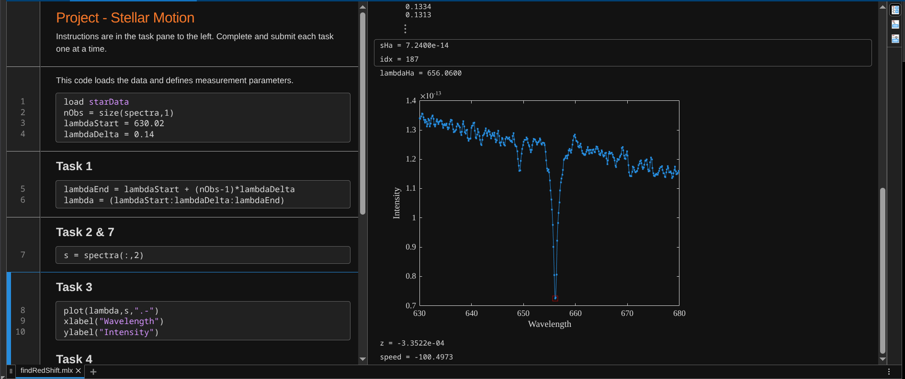

# MATLAB Stellar Spectra Redshift Analysis

This project analyzes stellar spectra to calculate redshift and estimate star velocity.

Dataset:
The spectra dataset comes from the MATLAB Onramp final project.
It contains spectral intensity measurements for 7 stars across 357 wavelength samples.

Main tasks:
- Plot stellar spectra
- Detect hydrogen-alpha absorption line
- Calculate redshift
- Estimate radial velocity of the star

How it works:

1. Load stellar spectra data
2. Generate wavelength vector
3. Plot the spectral intensity
4. Detect the hydrogen-alpha absorption line
5. Compute redshift using observed wavelength
6. Estimate star velocity using speed of light

## Dataset

The dataset `starData` is provided by the MATLAB Onramp training module.

It contains:
- `spectra` – spectral intensity measurements (357 × 7 matrix)
- `starnames` – names of the stars
- wavelength information used to compute hydrogen-alpha absorption.

Since the dataset belongs to the training environment, it is not included in this repository.

## Stellar Spectrum Plot

The hydrogen-alpha absorption line is detected in the stellar spectrum.  
The red square marks the absorption dip used to calculate the redshift.

## Dataset

The dataset `starData` is provided within the MATLAB Onramp training environment and is not included in this repository.

## Compare Stellar Spectra

This script plots the spectra of seven stars and compares their hydrogen-alpha absorption lines.
Stars moving **away from Earth (redshifted)** are plotted with thicker lines, while **blueshifted stars** are shown with dashed lines.

